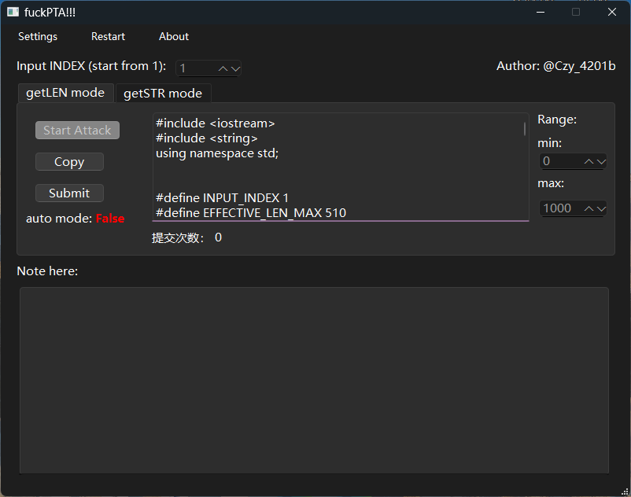
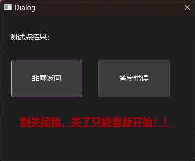
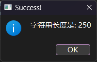
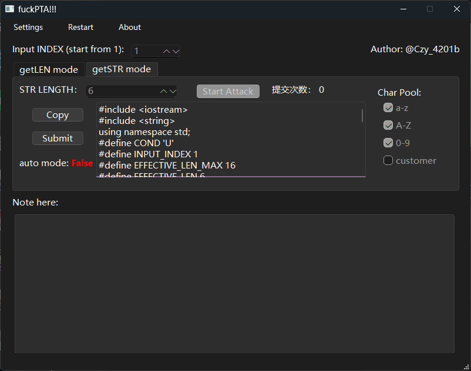
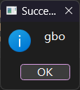

# fuckPTA
PTA测试点不透明？尝试利用二分回溯算法高效地爆破攻击他！这是我大一的作品，只能手动爆破测试点的内容，不过我现在已经没有精力更新它了哈哈
## 使用方式
1. 猜测输入长度

先选择PTA测试点可能输入的测试文本长度，比如0-1000，然后点击start attack开始加载cpp代码，复制之后提交到PTA平台，点击submit然后等待PTA返回测试点

如果说是非零返回，就点击非零返回，如果是答案错误就选择答案错误

选择之后呢，这个代码载荷会自动更新，继续复制，提交到网站，按下submit键，再选择，到达一定次数之后结果就会出现了

（毕竟是爆破，就算是算法优化，这里用的是二分法，也需要一定次数的，觉得麻烦就算了，如果你不是较真的人）

2. 猜测输入的测试文本

先选择PTA测试点可能输入的测试文本长度范围，然后右边勾选猜测范围，a-zA-Z0-9（就支持这么多，足够了）然后点击start attack开始加载cpp代码，复制之后提交到PTA平台，点击submit然后等待PTA返回测试点

然后也是一样，载荷代码会自动更新，点击copy复制，粘贴到网站上提交，看看测试点返回啥就选啥，不断重复直到出答案（这里使用二分回溯算法优化）

答案枚举出来了

就是这样玩的，具体原理还是读代码吧，至于二分回溯算法能省步数吗？理论上是可以的，不在极端情况下的话

相同候选字符azAZ09的情况下：

推断0000000000，用二分法也要个60次，可是用二分回溯法，只用5次

推断VV00000000，用二分法也要个60次左右，可是用二分回溯法，只用21次

## 二分回溯算法
[Dichback](https://github.com/SpeechlessMatt/Dichback)
